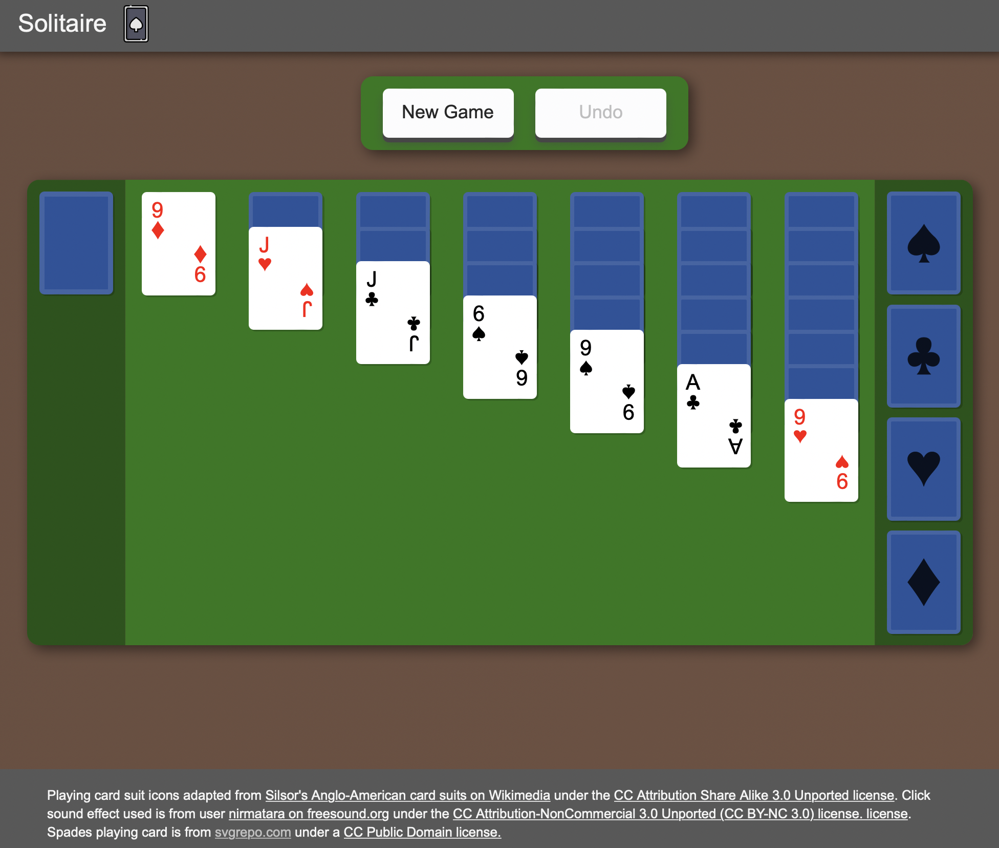

# Solitaire

## About

This project is a clone of the card game Solitaire for the web. I wrote it to deepen my understanding of TypeScript's mechanics and get a feel for modern web technologies, such as Webpack.

For attributions, please see the [third-party sources](https://github.com/SetKu/Solitaire/blob/main/3rd-party-sources.md) document.

## Technology

This project's scripting was written in [TypeScript](https://www.typescriptlang.org/), a compatibility layer for JavaScript, then compiled to ES6 JavaScript, which was then minified and had its dependencies handled by [Webpack](https://webpack.js.org/).

## Installation

To start, clone the repository down to your local machine and navigation into the folder in your terminal of choice. Please note, beyond this point the [Node Package Manager](https://www.npmjs.com/) version 16.11.18 or higher needs to be installed, plus Node itself.

To start this project, run `node server.js`. You can also type `npm run start` as an alternative. This will start up the project's web server using [ExpressJS](https://expressjs.com/) and let it begin to accept and respond to web traffic with the projects web files.

To enter development mode for this project, use the command `npm run build` to startup the TypeScript compiler and Webpack.
